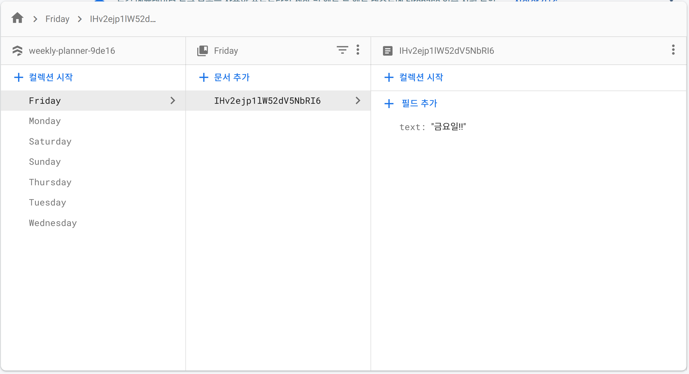
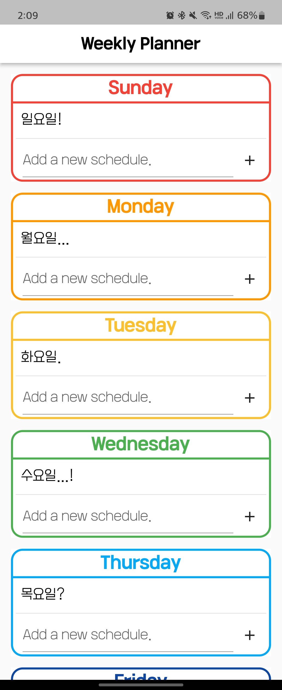
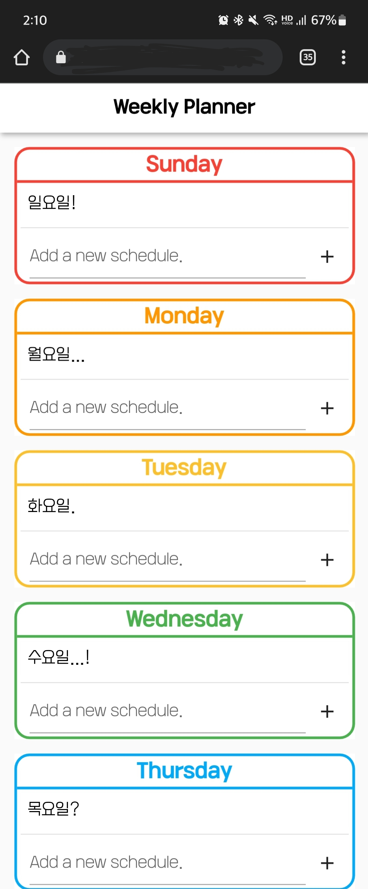
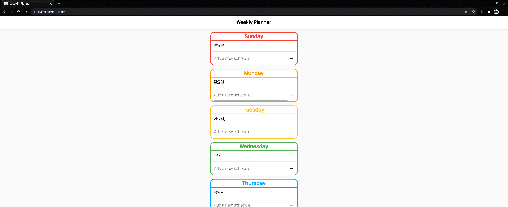
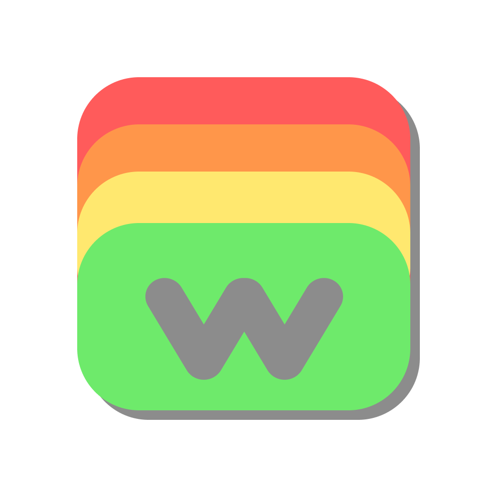

갑자기 뭔가 만들고 싶어졌다  
근데 만들게 없었다

그래서 나한테 필요한게 뭐가 있지... 라고 곰곰이 생각해봤다  
평소 플래너 작성의 필요성을 느끼고 있었는데  
종이에 쓰기는 또 귀찮아서 안 쓰고 있던(ㅋㅋ) 나는 그냥 이참에 앱을 하나 만들어보자고 결심했다  

앱 구상할 때의 조건
1. 서버에서 실시간 동기화
2. 크로스 플랫폼

1번은 파이어베이스를 이용해서 서버를 구축했고, 2번은 플러터로 앱을 개발하여 웹, 안드로이드 앱에서 실행 가능하도록 했다.  
플러터로 개발했기 때문에 ios에서도 쓸 수 있도록 할 수 있긴 한데  
애초에 나는 애플 기기가 없기 때문에 ㅋㅋ 필요가 없음  

웹 호스팅은 Netlify를 이용했다.  
플러터로 웹을 따로 빌드해준 다음, 깃허브 레포지토리에 push하면 자동으로 호스팅해준다.  
원래 파이어베이스의 호스팅 서비스를 이용했었는데 이게 더 편한 듯  
도메인은 그냥 원래 소유하고 있던 도메인을 사용했다. 근데 도메인 이름이 마음에 안 들어서 다른 도메인을 새로 사고 싶다... 도메인에 숫자 들어가니까 보기 확 불편해짐  

위 사진처럼 일단 데이터베이스 구조 자체가 유저별로 데이터를 나눠서 저장하는 방식이 아니기 때문에 한명밖에 못쓰고, 그래서 나만 쓰는 앱이 되어버렸다 ㅋㅋㅋ  
Firebase Auth로 로그인 기능만 넣으면 데이터 구조 바꾸는건 되게 간단한데 로그인 기능 넣기가 너무 귀찮고 어렵다.  
저번에 구글 코드랩 예제 한번 따라해봤었는데 뭔가 엄청 복잡함...  

그래서 당분간은 나만 쓰려고 한다... 나중에 심심하면 만들어봐야지  

---

|

안드로이드 앱 / 웹  

 

모바일 용으로 만들었기 때문에 PC에서는 확실히 가독성이 떨어지고 공간 활용도가 아주 낮다... 하지만 정상적으로 작동한다  

---

대충 이런 앱이고 저 일정 목록을 좌우로 드래그 하면 삭제된다(당연히 서버에서도 실시간으로 삭제된다)  

화면이 전체적으로 밝은 톤이라서 나중에 시간되면 다크모드도 한 번 연습삼아 넣어볼까 한다    

나름 앱 아이콘도 Figma로 대충 빠르게 만들어봤다 ㅋㅋㅋㅋㅋ    
원래 저 w가 안 들어가있었는데 너무 허전해서 넣었다    
그리고 "이왕 w 넣은 김에 w를 강조해보자!" 해서 앱 이름을 Weekly Planner에서 WPlanner로 바꿈 ㅋㅋㅋ 단순  
~~근데 생각보다 맘에 든다~~

 
아무튼 이렇게 3일동안 연습 삼아 만들어본 플래너 앱이었습니다 짝짝짝  

 
- - -

**※ 로그인 기능 구현됐습니다.**   
[그 플래너 로그인 기능 만들었다](/_posts/2022-02-24-WPlanner-2.md)
