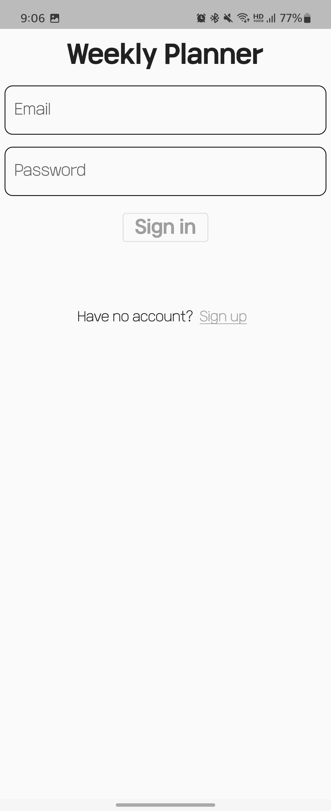
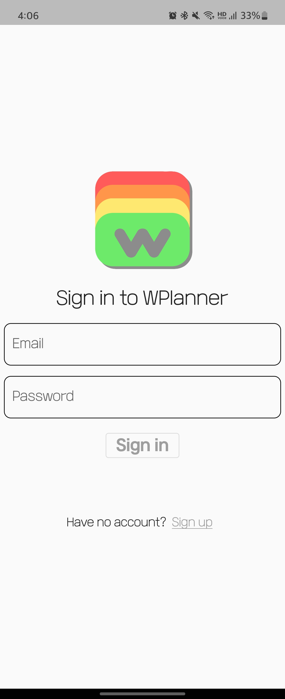

|

로그인 화면 바꿈

어차피 한번 로그인하면 자동 로그인이라 별 상관 없긴 한데
그래도 뭔가 아랫쪽이 텅텅 비어있는게 너무 보기 싫어서 새벽에 급하게 좀 고쳤다

​
전보다는 나은듯

 

* * *
# 다운로드  

> 웹버전 링크 :  
> [planner.jcy1511.com](https://planner.jcy1511.com)
>
> 안드로이드 설치 파일 :  
> [WPlanner.apk](https://drive.google.com/file/d/1NUYf-78-nna7pP4Wff-fksBsiK4p2Rtr/view?usp=sharing)  

 