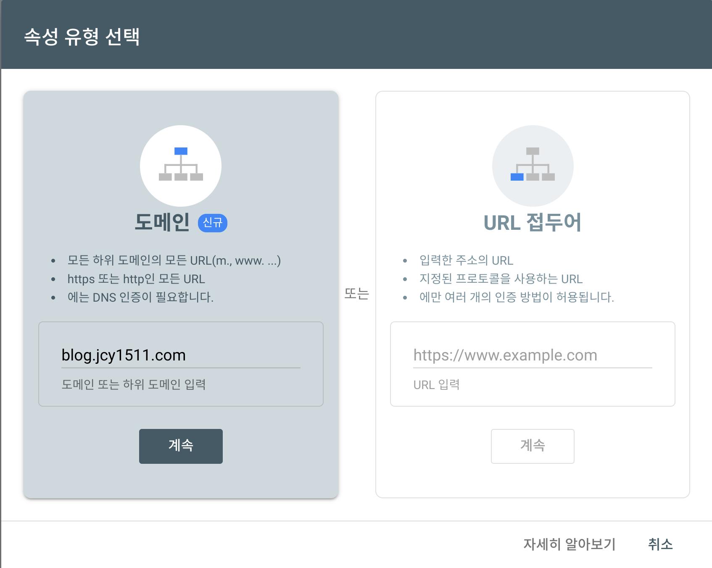

기본적인 깃허브 블로그 세팅이 끝났고, 원래 쓰던 블로그에서 글도 몇 개 옮겨와서 포스트도 조금 채워놨으니 이제는 실제로 블로그를 노출시킬 차례가 왔다.

일단 [Google Search Console](https://search.google.com/search-console/about)에 들어가서 도메인 추가를 해주자.  

  

나는 Custom domain을 사용하고 있기 때문에 왼쪽 옵션을 선택했다.  
도메인 주소를 입력해준다.


왜인지 정확히는 모르겠지만 나는 자동으로 소유권이 확인되었다  
하지만 자동으로 확인이 되지 않더라도 그냥 하라는 대로 DNS 인증 해주면 되는 것 같다.

---

|

그리고 다시 로컬로 돌아와서 이렇게 블로그 파일의 root 위치, 즉 가장 바깥 폴더(_config.yml 있는 곳 맞음)에 sitemap.xml, robots.xml을 만들어준다.  
그리고 각각의 파일들에 아래의 내용을 써주면 된다.

## sitemap.xml  

``` html
---
layout: null
---

<?xml version="1.0" encoding="UTF-8"?>
<urlset xmlns:xsi="http://www.w3.org/2001/XMLSchema-instance"
        xsi:schemaLocation="http://www.sitemaps.org/schemas/sitemap/0.9 http://www.sitemaps.org/schemas/sitemap/0.9/sitemap.xsd"
        xmlns="http://www.sitemaps.org/schemas/sitemap/0.9">
    
    <url>
        <loc>{{ site.url }}{{ post.url }}</loc>
        
        <lastmod>{{ post.date | date_to_xmlschema }}</lastmod>
        
        <lastmod>{{ post.lastmod | date_to_xmlschema }}</lastmod>
        

        
        <changefreq>weekly</changefreq>
        
        <changefreq>{{ post.sitemap.changefreq }}</changefreq>
        

        
        <priority>0.5</priority>
        
        <priority>{{ post.sitemap.priority }}</priority>
        

    </url>
    
</urlset>
```


<br/>
## robots.txt
```
 User-agent: *
 Allow: /
 Sitemap: https://blog.jcy1511.com/sitemap.xml
```
당연히 여기서 sitemap 주소를 자신의 sitemap 주소로 바꿔주면 된다.

그리고 실제로 깃허브에 push 하기 전, 로컬 서버에서 sitemap.xml 파일이 잘 나오는지 확인해보자.


(잘 나온다)

그리고 나서 깃허브에 push를 해주고, 실제 페이지(ex. [blog.jcy1511.com/sitemap.xml](https://blog.jcy1511.com/sitemap.xml))에서도 위 사진처럼 sitemap.xml 파일이 정상적으로 표시되는 것을 확인한 후,    
이제 마지막으로 Google Search Console에 sitemap.xml 파일을 제출해주면 끝난다


실제로 구글 검색에 노출되기까지는 며칠정도 걸린다고 한다.  
빨리되면 좋겠다 ㅎㅎ


